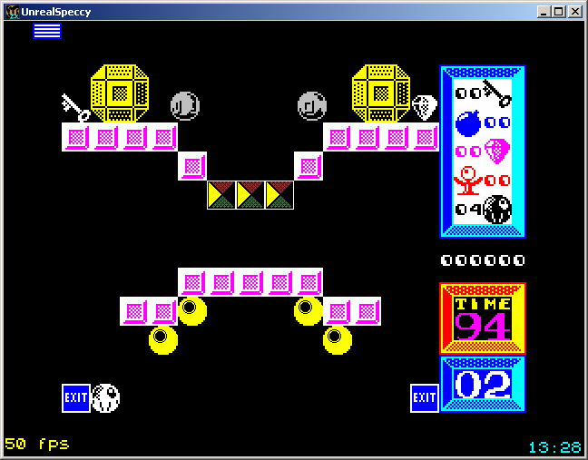

# Hello, world!

For starters, let's practice recoloring a couple of sprites in a small game titled [I, Ball II](http://www.worldofspectrum.org/infoseek.cgi?regexp=^I%2c+Ball+2%3a+Quest+for+the+Past$&loadpics=3).

Download and extract the archive [iball2.zip](files/iball2.zip). It contains a minimal binary distribution of a modified open source Spectrum emulator [Unreal Speccy](http://dlcorp.nedopc.com/viewforum.php?f=27&sid=9c36f0fd40937a326424f2719edb5a4a) (the main executable file is renamed into `iball2.exe`), and a SNA image of I, Ball II. The snapshot is taken at the beginning of level 2, since it contains the sprites of our interest.

Run the game (i.e., execute `iball2.exe`) and make sure that everything works correctly. The controls are set to Sinclair joystick (keyboard keys 6, 7, 8, 9, 0). Initially, the game screen should look like this:

Now let's update the sprites of yellow balls and gray boxes:

1. Create a subfolder `game` inside the game folder. Here you should place both the old sprite pictures you want to substitute and their upgraded versions. For the balls and the boxes you'll need [these pictures](files/iball2_pics.zip).

2. Create in the same `game` subfolder a file `settings.txt`, containing the following lines:

        0 block zx_yellowball.bmp pc_yellowball.bmp
        0 pixel zx_graybrick.bmp pc_graybrick.bmp
        
That's it! Run the game and enjoy the result:

Some final notes:

- Recolored screen is twice wider and twice higher than the original ZX Spectrum screen, so in most cases recolored sprites should also be twice wider and twice higher than their original counterparts.

- Both original and recolored sprites should be stored in the BMP 24bpp format. Areas painted with the pinkish color `RGB(242, 10, 242)` are treated as transparent.

- All non-transparent pixels in the original sprites must be either black (ink) or white (paper).

- The configuration file `settings.txt` consists of lines including at least the following compulsory elements:

        <layer-number> <rule-type> <original-sprite> <new-sprite>

    Layers are needed to organize background and foreground elements properly. The system draws sprites layer by layer, so foreground sprites should be placed on higher-numbered layers.

    Different rule types are used here to reduce CPU load. Fast cell-precise `block` rules assume that the original sprites are always aligned with the borders of 8x8 pixel blocks (which is a very common case for background objects). In contrast, slower pixel-precise `pixel` rules perform complete searching.

    In our case, yellow balls never leave their initial positions, so cell-precise matching is sufficient. However, gray boxes fall down when touched, so pixel-precise matching is necessary in their case.

In practice everything is usually not so simple. Keep reading!
