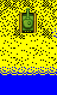
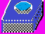
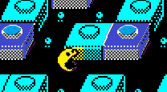
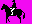
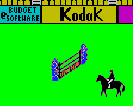

# Tips and tricks

Recoloring can be tricky at times. Here are some ideas to help you to deal with typical situations.

## Block and pixel matching

If you are pretty sure that a certain sprite is always block-aligned, simply use a block-precise rule:

    0 block zx_bow.bmp pc_bow.bmp

| zx_bow.bmp | pc_bow.bmp |
|----------- |-------	  |
|   |  |   

If you are dealing with a moving object, use a pixel-precise rule, and don't forget about transparency, if the object moves over a non-solid background:

    0 pixel zx_tank.bmp pc_tank.bmp

| zx_tank.bmp | pc_tank.bmp | result  |
|----------- |-------	  |-----	|
|  	 |  	  |    	|   

Remember, though, that Spectrum sprites can be quite deceptive. Sometimes you may have to deal with sprites that look like this:

You might think that everything is clear: the character area shold be black, and the rest is transparent. However, this is often incorrect: if you try matching this image, you will get a perfect match for the sprite inside any solid black box! By providing a black-and-pinkish image, you are telling the system: I want these pixels to be of ink color, and I don't care about the rest. Thus, most images used for recognition should have areas of all three types: ink, paper, and transparent.

## Dealing with partial intersections

If two objects you want see recolored intersect, plain full-sprite matching will not work. There are several ways to deal with this issue, so you will need to choose the right method depending on your particular case.

If you believe that a large enough part of certain object will never be obscured, use it to recognize the full object. This is perhaps the most universal approach that works for all kinds of objects in all situations. However, if you choose a very small fragment for matching, you might get false positives (i.e., accidental matches in unexpected places). Use `block` matching, if possible, to reduce the chance of a false positive:

    ; note that two rules are used to recognize the block
    0 pixel zx_pacman_block-1.bmp pc_pacman_block.bmp
    0 pixel zx_pacman_block-2.bmp pc_pacman_block.bmp
    1 pixel zx_pacman1.bmp pc_pacman1.bmp
    1 pixel zx_pacman2.bmp pc_pacman2.bmp
    1 pixel zx_pacman3.bmp pc_pacman3.bmp
    1 pixel zx_pacman4.bmp pc_pacman4.bmp
    1 pixel zx_pacman5.bmp pc_pacman5.bmp

| original   | recolored | result  |
|-------- |-------	  |---------|
|       |       |  |

If you want to recolor an immovable background object, the easiest solution is to use `protected` clause:

    0 block zx_hurdle.bmp pc_hurdle.bmp protected|100
    1 pixel horse1.bmp pc_horse1.bmp
    1 pixel horse2.bmp pc_horse2.bmp
    1 pixel horse3.bmp pc_horse3.bmp

| original   | recolored | result  |
|-------- |-------	  |---------|
|    |     |  |

Remember that the number of pixels checked by the `protected` keyword does not include transparent areas, so this value should be chosen carefully. Suppose you have an 8x8 box in your sprite, marked as a background. If the screens goes blank for some reason, the system will still think that at least 64 pixels of the original sprite are still there.

<!-- 
Guess your situation using secondary information RS, IB2

Matching partially intersecting sprites

Matching small immovable background sprites

Rearranging screen layout, drawing decoration

-->